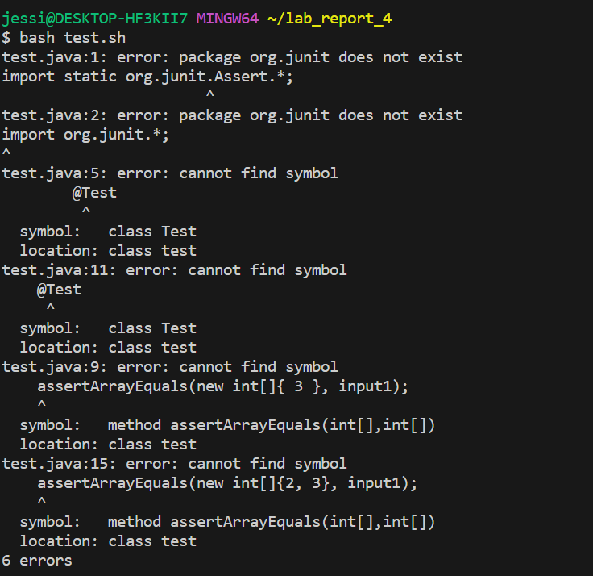
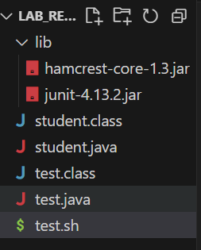
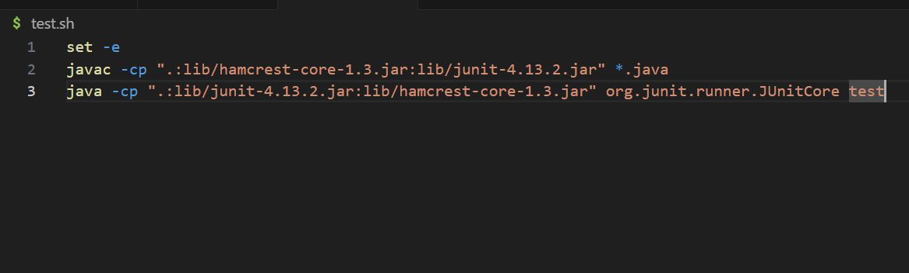
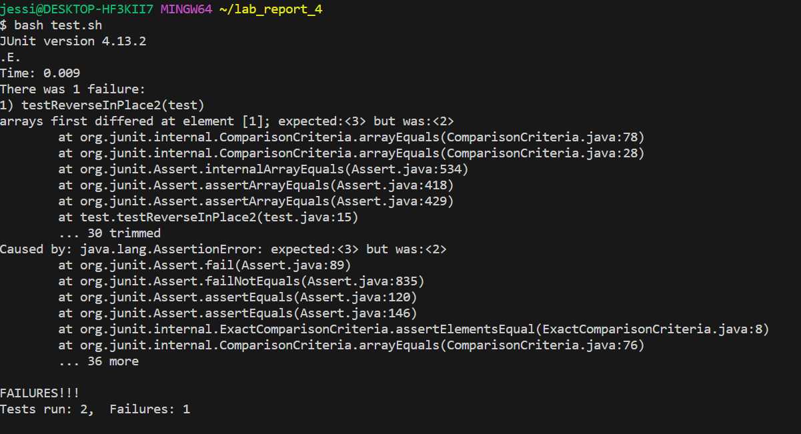
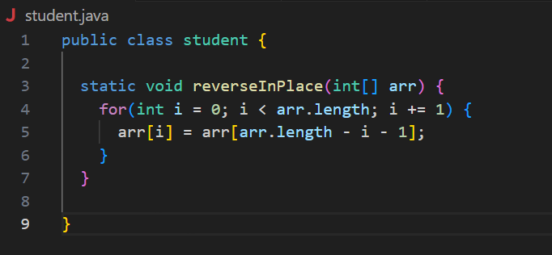
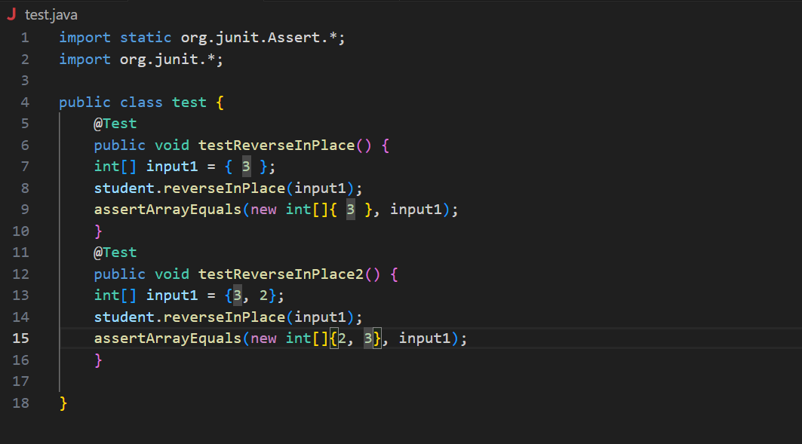
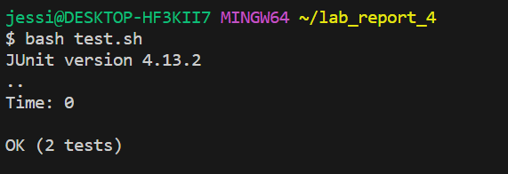

## Part 1 – Debugging Scenario
**Student**:
Hi, I think that is something wrong with junit test. When I use ` bash test.sh` to test my code with comile junit on it, It fails said cannot find Junit. But I am should that there is a file call lib and the junit package is in it. How can I fix it?

**TA**:
Hi, Can I see your test.sh file? it should be something wrong in the file that cause this kind of error. You might write the path of the junit package wrong.

**Student**:
Sure! But the codes I wrote for the test.sh are copy from lab3 document which should be correct and my peer run the same code and they can run without such error. 

**TA**:
I see. I think the code have no error. Do you use Windows system or IOS system? It might works different on different computer system. If you using Window system, Please try to make all the `:` to be `;`. For examples, `.:lib/hamcrest-core-1.3.jar:lib/junit-4.13.2.jar` should be `.;lib/hamcrest-core-1.3.jar;lib/junit-4.13.2.jar` in Windows system.

**Student**:
Oh, yeah! I use windows system, and I try to make all the  `:` to `;` and it works!! But need help with my code now. I already swich the last elements to the front, why I cannot pass the test I wrote?

**TA**:
Can I see your code and tests? I can help you to debug it.

**Student**:
Here it is! Thank you for helping me!

**TA**:
No problems. In your code, you only swich the last elements to the front but did not swich the back elements to the front, so the last half of the array will stay the same, which cause errors. In the test error message, you can see that in the position 1, expect value is 3, but the actual is 2, which means that the second value did not change at all and you need to fix it.

**Student**:
Oh! yeah, I got it! Thanks！

#### The file & directory structure needed

#### The contents of each file before fixing the bug

#### The full command line (or lines) you ran to trigger the bug
`bash test.sh`

#### A description of what to edit to fix the bug
- It might works different on different computer system. If you using Window system, Please try to make all the `:` to be `;`. For examples, `.:lib/hamcrest-core-1.3.jar:lib/junit-4.13.2.jar` should be `.;lib/hamcrest-core-1.3.jar;lib/junit-4.13.2.jar` in Windows system.
- In your code, you only swich the last elements to the front but did not swich the back elements to the front, so the last half of the array will stay the same, which cause errors. In the test error message, you can see that in the position 1, expect value is 3, but the actual is 2, which means that the second value did not change at all and you need to fix it.

## Part 2 – Reflection
